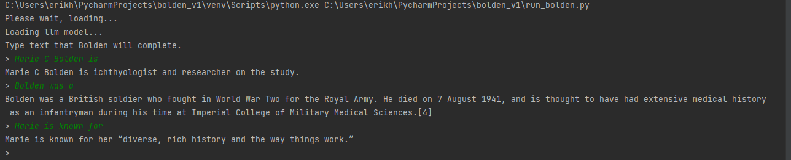

# What is Bolden?

This model was created to honor Marie C. Bolden, who was a spelling bee champ: 
https://en.wikipedia.org/wiki/1908_National_Education_Association_Spelling_Bee

# What is the purpose of the Bolden LLM?

It's an example of how to train a model from Scratch, and with a little effort, I may build it into something that is usable for more than education.

### Example output
Clearly the model is wildly inaccurate, but the output is otherwise fine for a small LLM.
